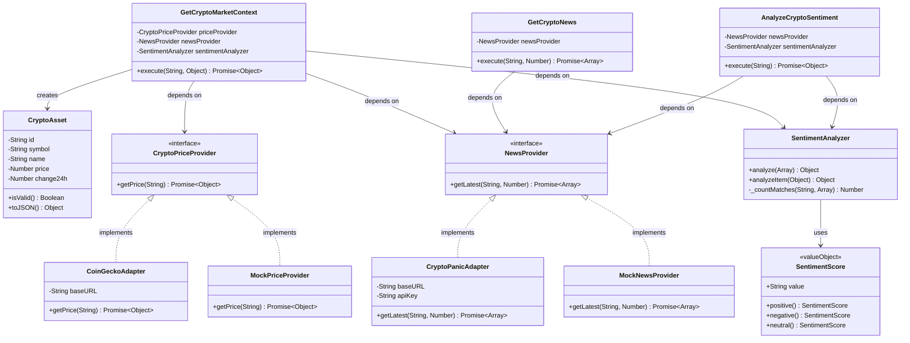

# Class Diagram

This diagram shows the relationships between domain entities, value objects, services, ports, and adapters.

## Description

This class diagram shows the structure of the domain and application layers:

**Domain Layer:**
- `CryptoAsset` - Entity representing a cryptocurrency with price and change data
- `SentimentScore` - Value object that encapsulates sentiment values (positive, negative, neutral)
- `SentimentAnalyzer` - Domain service that analyzes sentiment from news text

**Ports (Interfaces):**
- `CryptoPriceProvider` - Contract for price data providers
- `NewsProvider` - Contract for news data providers

**Adapters (Implementations):**
- `CoinGeckoAdapter` - Real implementation using CoinGecko API
- `CryptoPanicAdapter` - Real implementation using CryptoPanic API
- `MockPriceProvider` - Mock implementation for development/testing
- `MockNewsProvider` - Mock implementation for development/testing

**Use Cases:**
- `GetCryptoMarketContext` - Orchestrates fetching price, news, and sentiment analysis
- `GetCryptoNews` - Retrieves news for a cryptocurrency
- `AnalyzeCryptoSentiment` - Analyzes sentiment from news

The diagram shows how use cases depend on ports (interfaces) rather than concrete implementations, following the Dependency Inversion Principle. Adapters implement the ports, allowing the system to swap implementations without changing business logic.

## What's Omitted

This diagram focuses on the core domain and application layers. It omits:

- **HTTP layer** (controllers, routes) - shown in the [Module Structure](modules.md) diagram
- **Infrastructure details** (config, container) - shown in the [Component-Connector](component-connector.md) view
- **Frontend components** - shown in the [Containers](containers.md) and [Component-Connector](component-connector.md) views
- **Internal adapter methods** (like `_getCurrencyCode` in CryptoPanicAdapter) - implementation details not relevant to the architecture
- **Error handling classes** - error handling is part of the use case logic, not separate classes
- **Request/Response DTOs** - these are simple objects, not classes with behavior
