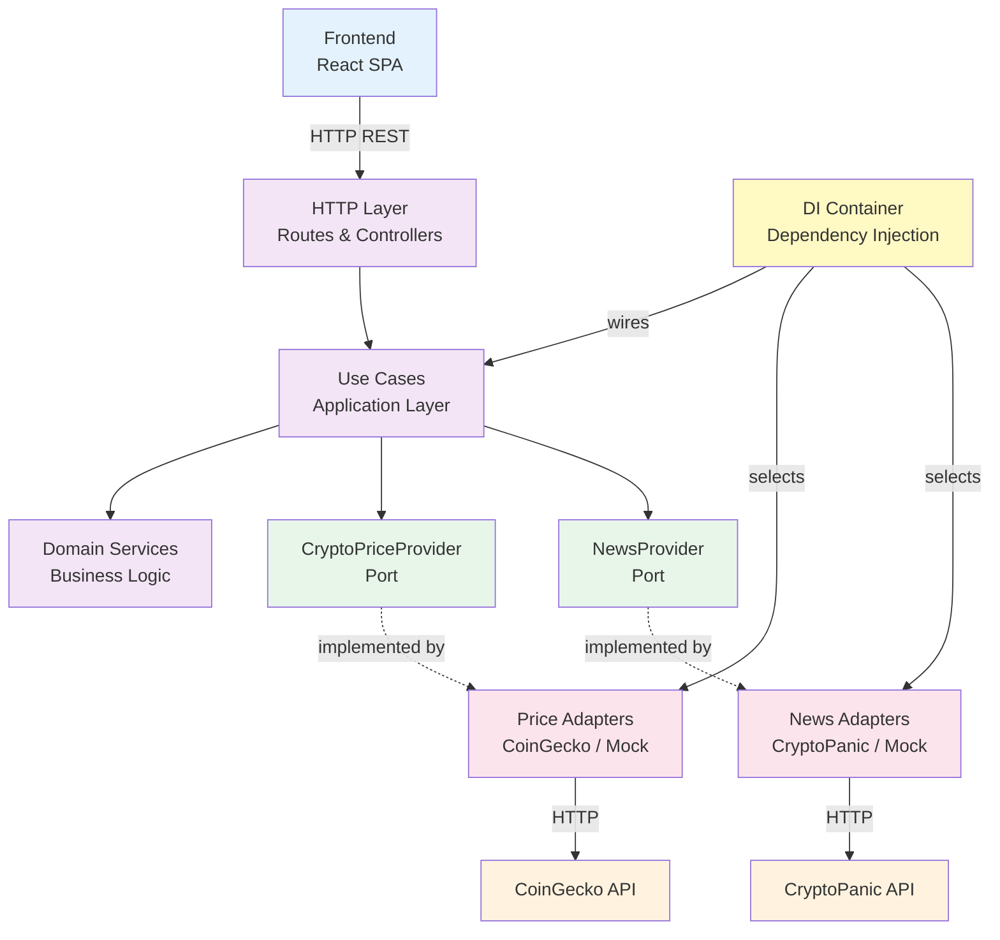

# Component-Connector View

This diagram shows how the main components are connected and communicate in the system.

## Description

This component-connector view shows how the main architectural components connect:

**Frontend** - React single-page application that displays the dashboard and makes HTTP requests to the backend.

**HTTP Layer** - Express routes and controllers that handle incoming requests, extract parameters, and delegate to use cases.

**Use Cases** - Application layer that orchestrates business operations. They depend on ports (interfaces) rather than concrete implementations.

**Domain Services** - Pure business logic (like SentimentAnalyzer) that operates on domain concepts without external dependencies.

**Ports** - Interfaces that define contracts for external dependencies (CryptoPriceProvider, NewsProvider). They specify what the system needs, not how it's implemented.

**Adapters** - Implementations of the ports. Can be real (CoinGecko, CryptoPanic) or mock implementations. The DI Container selects which adapter to use based on configuration.

**DI Container** - Infrastructure component that wires dependencies together, selecting adapters based on environment variables (like `USE_MOCK_PROVIDERS`).

**External APIs** - Third-party services that provide price and news data.

**Connections:**
- Solid arrows show direct calls/dependencies
- Dotted arrows show interface implementations
- The DI Container wires everything together at startup

This architecture allows the system to easily swap between real APIs and mocks without changing business logic, making it testable and flexible.

## What's Omitted

This high-level view focuses on architectural components and omits implementation details:

- **Internal frontend structure** - React components, hooks, and React Query are internal to the Frontend component
- **Individual use cases** - The three use cases (GetCryptoMarketContext, GetCryptoNews, AnalyzeCryptoSentiment) are grouped as "Use Cases"
- **Domain entities and value objects** - CryptoAsset, SentimentScore are internal to Domain Services
- **Individual adapters** - CoinGeckoAdapter, CryptoPanicAdapter, and mocks are grouped by type
- **Middleware** - Express middleware (CORS, error handling) is part of HTTP Layer
- **Error handling** - Integrated into components, not shown as separate components
- **Configuration** - Environment variables and config loading are part of DI Container
- **Request/Response details** - DTOs and data transformations are implementation details
- **Caching** - React Query caching is internal to Frontend
- **Testing infrastructure** - Test setup and test doubles are not shown

For more detailed views, see:
- [Class Diagram](class-diagram.md) - Shows individual classes and their relationships
- [Data Flow](data-flow.md) - Shows detailed request flow
- [Use Case Flow](use-case-flow.md) - Shows internal logic of use cases
