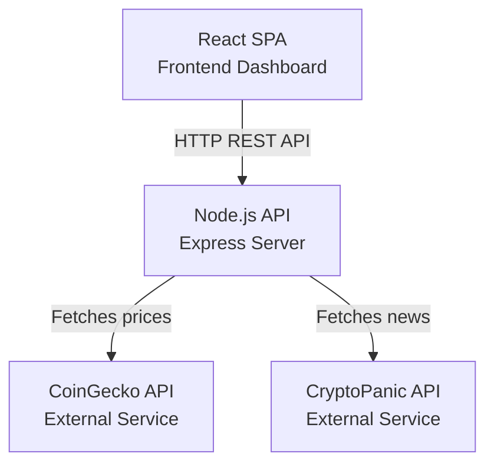

# Containers

This diagram shows the main applications and external services that make up the system.

## Description

The system consists of three main containers:

**React SPA** - The frontend application that users interact with. It's a single-page application built with React and TypeScript that displays market data and sentiment analysis. It communicates with the backend via REST API calls.

**Node.js API** - The backend server built with Express. It handles HTTP requests from the frontend, coordinates data fetching from external APIs, and performs sentiment analysis. It exposes a REST API with endpoints for market context, news, and sentiment.

**External APIs** - CoinGecko provides cryptocurrency price data, and CryptoPanic provides news headlines. The backend fetches data from these services and processes it before sending it to the frontend.
