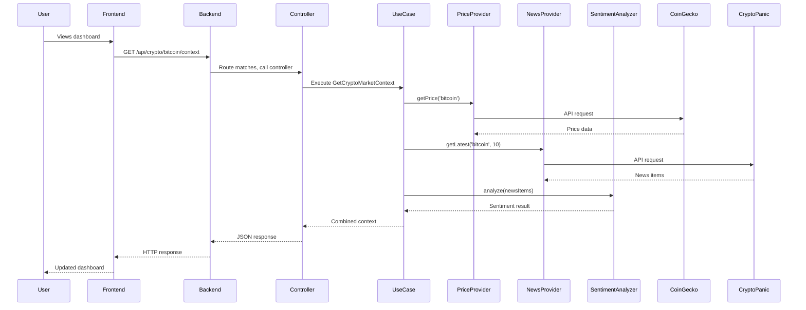

# Data Flow

This diagram shows how a request flows through the system from the frontend to external APIs and back.

## Description

When a user views the dashboard:

1. The React app uses the `useCryptoContext` hook, which triggers a React Query request.

2. React Query makes an HTTP GET request to `/api/crypto/:assetId/context`.

3. The Express router matches the route and calls `cryptoController.getMarketContext`.

4. The controller extracts the `assetId` from the URL parameters and calls `container.getCryptoMarketContext.execute()`.

5. The use case coordinates three operations:
   - Calls `priceProvider.getPrice()` which fetches from CoinGecko
   - Calls `newsProvider.getLatest()` which fetches from CryptoPanic
   - Calls `sentimentAnalyzer.analyze()` which processes the news items

6. The use case combines all the data into a single context object and returns it.

7. The controller wraps the result in a JSON response with `{success: true, data: ...}`.

8. React Query receives the response, caches it, and updates the UI components.

The frontend automatically refetches this data every minute to keep the dashboard up to date.
