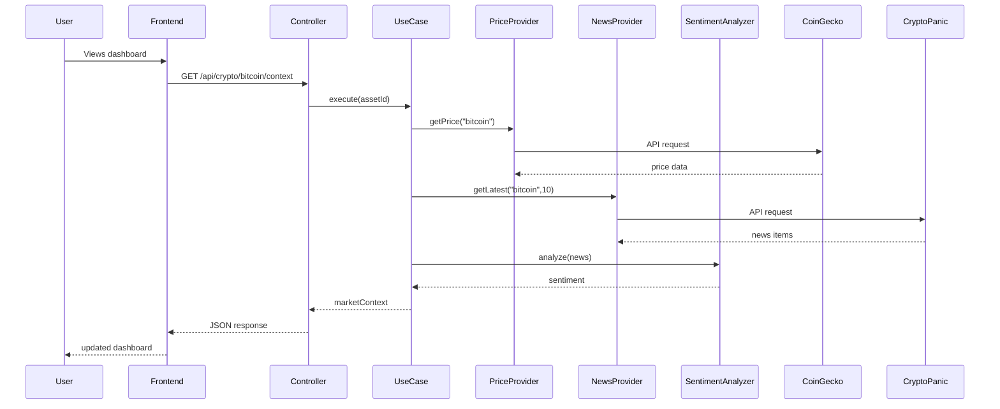
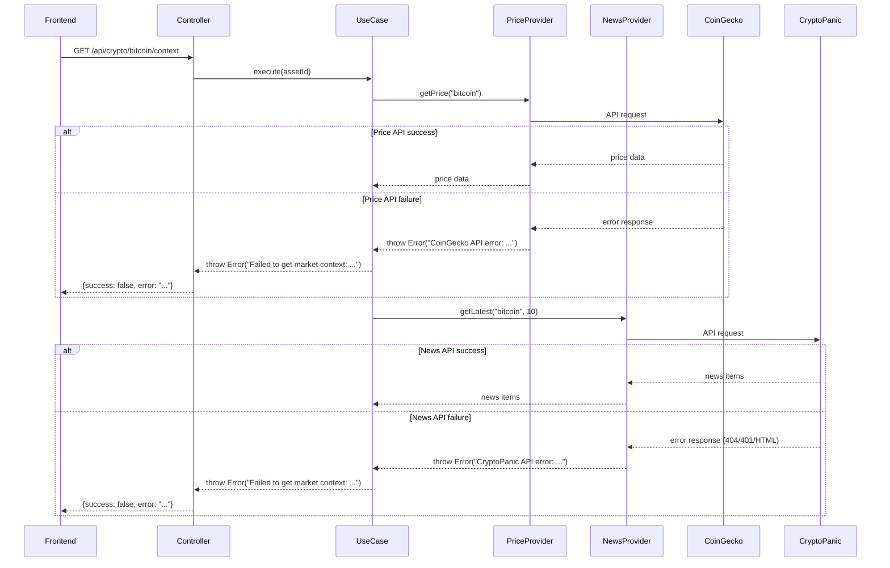

# Data Flow

This diagram shows how a request flows through the system from the frontend to external APIs and back.

## Description

When a user views the dashboard:

1. The React app uses the `useCryptoContext` hook, which triggers a React Query request.

2. React Query makes an HTTP GET request to `/api/crypto/:assetId/context`.

3. The Express router matches the route and calls `cryptoController.getMarketContext`.

4. The controller extracts the `assetId` from the URL parameters and calls `container.getCryptoMarketContext.execute(assetId)`.

5. The use case coordinates three operations:
   - Calls `priceProvider.getPrice("bitcoin")` which fetches from CoinGecko API
   - Calls `newsProvider.getLatest("bitcoin", 10)` which fetches from CryptoPanic API
   - Calls `sentimentAnalyzer.analyze(news)` which processes the news items locally

6. The use case combines all the data (price, news, sentiment) into a single market context object and returns it.

7. The controller wraps the result in a JSON response with `{success: true, data: ...}`.

8. React Query receives the response, caches it, and updates the UI components.

The frontend automatically refetches this data every minute to keep the dashboard up to date.

## Error Handling

When an API call fails, errors are propagated through the layers with context:

### Error Propagation

1. **Adapter Level** - When an API call fails, adapters catch the error and throw a new `Error` with a descriptive message:
   - `CoinGecko API error: 404 - Not Found`
   - `CryptoPanic API error: 404 - Not Found`
   - `API request failed - no response received` (timeout/network error)

2. **Use Case Level** - The use case catches any error and re-throws it with additional context:
   - `Failed to get market context for bitcoin: CoinGecko API error: ...`
   - This provides context about which operation failed

3. **Controller Level** - The controller catches errors and passes them to Express error handling middleware:
   - Sets `statusCode` (default 500)
   - Returns JSON response: `{success: false, error: "error message"}`

4. **Frontend** - React Query receives the error response and can handle it in the UI (show error message, retry, etc.)

This error handling strategy ensures that:
- Errors are caught at each layer with appropriate context
- Error messages are descriptive and help with debugging
- The frontend receives clear error information
- The system fails gracefully without crashing
