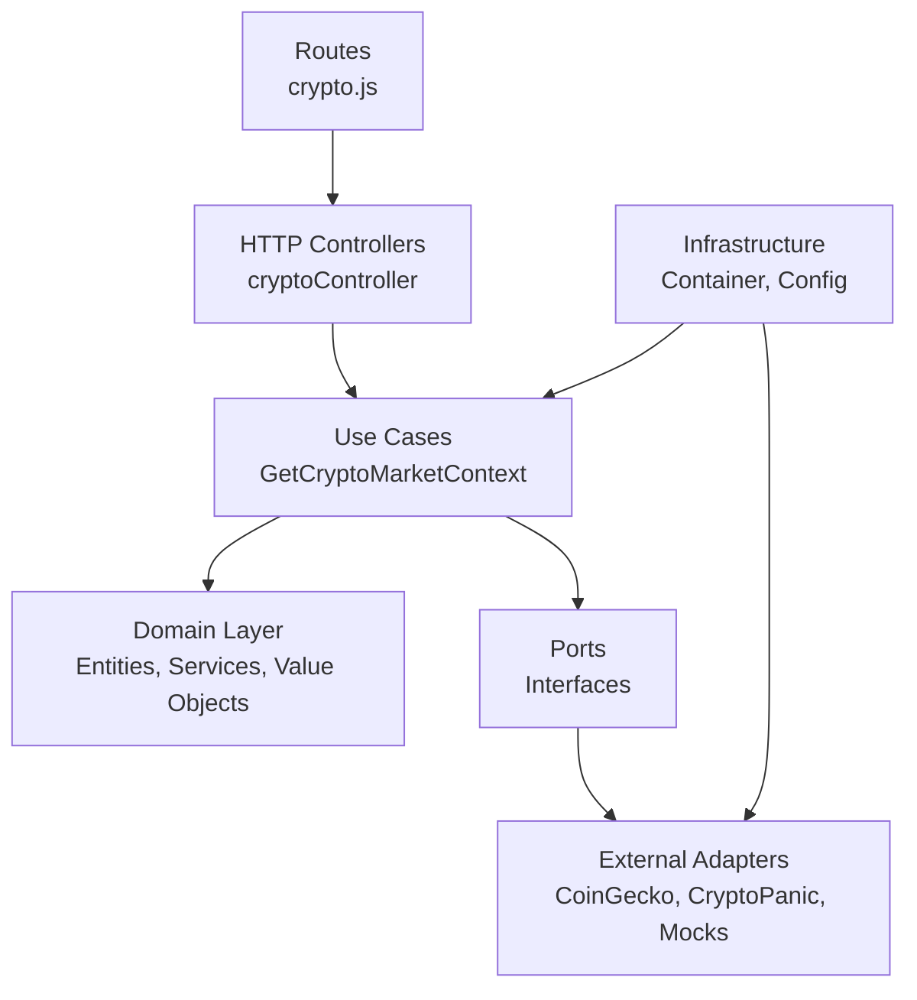

# Module Structure

This diagram shows how the backend modules are organized using hexagonal architecture.

## Description

The backend is organized in layers:

**HTTP Layer** - Routes and controllers handle incoming HTTP requests. They extract parameters and delegate to use cases.

**Application Layer** - Use cases orchestrate business operations. For example, `GetCryptoMarketContext` coordinates fetching prices, news, and analyzing sentiment.

**Domain Layer** - Contains pure business logic with no external dependencies. This includes entities like `CryptoAsset`, value objects like `SentimentScore`, and domain services like `SentimentAnalyzer`.

**Ports** - Interfaces that define contracts for external dependencies. They specify what the system needs (like `CryptoPriceProvider`) without defining how it's implemented.

**Adapters** - Implementations of the ports. `CoinGeckoAdapter` implements `CryptoPriceProvider`, `CryptoPanicAdapter` implements `NewsProvider`, and there are mock adapters for development.

**Infrastructure** - Configuration and dependency injection. The container wires everything together, deciding which adapters to use based on environment variables.

This structure keeps business logic separate from external concerns, making the system easier to test and modify.
