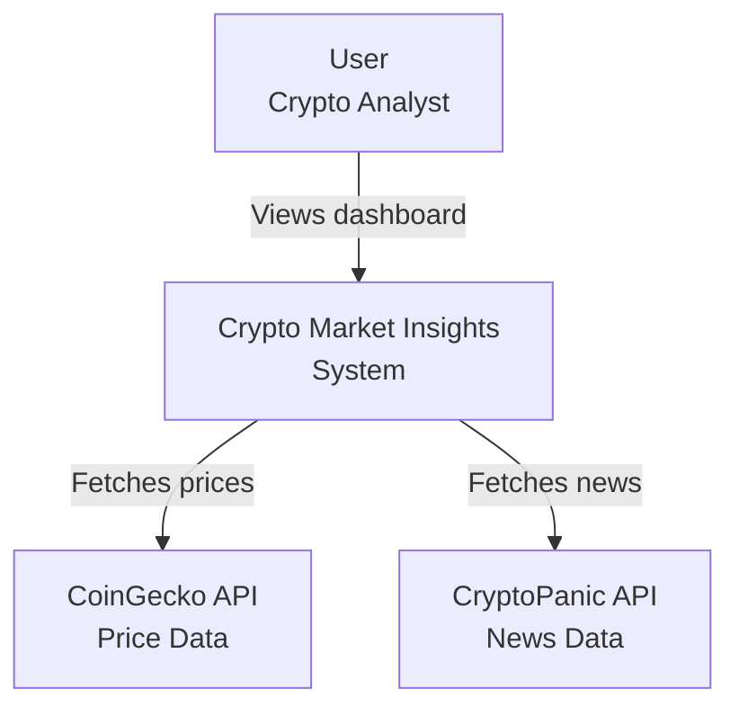

# System Context

This diagram shows the system at the highest level and how it interacts with users and external services.

## Description

Users interact with the Crypto Market Insights dashboard to view cryptocurrency market data and sentiment analysis. The system fetches real-time price information from CoinGecko and recent news headlines from CryptoPanic, then processes this data to provide market context.

The system acts as an aggregator and analyzer, combining data from multiple sources to give users a unified view of market conditions.
