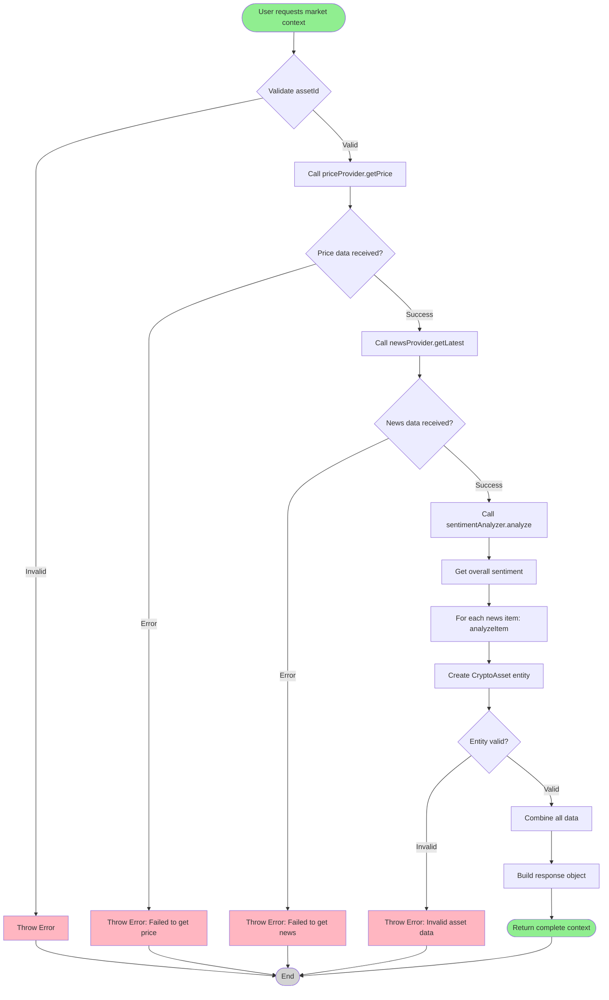

# Use Case Flow

This diagram shows the detailed internal flow of the `GetCryptoMarketContext` use case.

## Description

The `GetCryptoMarketContext` use case follows this flow:

1. **Validation** - Validates that `assetId` is provided
2. **Fetch Price** - Calls `priceProvider.getPrice(assetId)` to get current price data
3. **Fetch News** - Calls `newsProvider.getLatest(assetId, limit)` to get news items
4. **Analyze Overall Sentiment** - Calls `sentimentAnalyzer.analyze(newsItems)` to get overall sentiment
5. **Analyze Individual Items** - For each news item, calls `sentimentAnalyzer.analyzeItem(item)` to get per-item sentiment
6. **Create Entity** - Creates a `CryptoAsset` domain entity from price data
7. **Validate Entity** - Ensures the entity is valid
8. **Combine Data** - Combines asset, sentiment, and headlines into a single context object
9. **Return** - Returns the complete market context

If any step fails, an error is thrown with context about what failed. This ensures the use case fails fast and provides clear error messages.

## What's Omitted

This diagram focuses on the main success path and critical error points. It omits:

- **Parallel execution details** - The diagram shows sequential steps, but `analyzeItem` calls for each news item happen in parallel using `Promise.all()`
- **Retry logic** - No retry mechanisms are shown (currently not implemented)
- **Caching** - Response caching happens at the HTTP/React Query layer, not in the use case
- **Logging** - Logging statements are omitted for clarity
- **Data transformation details** - The exact mapping between API responses and domain objects is simplified
- **Other use cases** - Only `GetCryptoMarketContext` is shown; `GetCryptoNews` and `AnalyzeCryptoSentiment` have simpler flows
- **Timeout handling** - Adapter timeouts are handled internally, not shown here
- **Empty result handling** - Edge cases like empty news arrays are handled but not shown in detail
